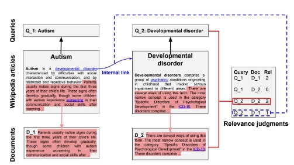
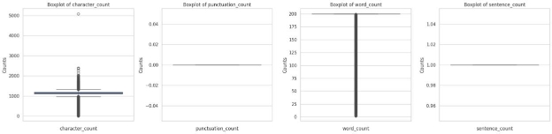
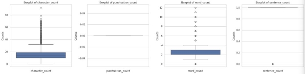
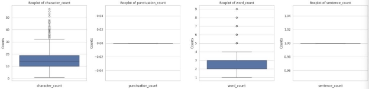
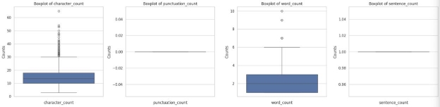

Information Retrieval 

*Project Wikir59k*

Introduction 

The project consists of creating a search engine for the wikir59k dataset. The WIKIR dataset contains a collection of documents extracted from the English version of Wikipedia. These documents cover a wide range of topics and can address virtually any subject present on Wikipedia. 

An exploratory analysis will be conducted to evaluate the dataset to study the most efficient approach. Models such as TF-IDF and BM25 will be used. The best model was improved using query expansion techniques and finally reranking with BERT was performed. 

Test Collection - Analysis of Queries and Documents 

To evaluate the effectiveness of our models we use a "lab-based" evaluation: the Cranfield Experiments. In accordance with them, we use three elements for the evaluation: a collection of benchmark documents (documents with columns "id\_right" and "text\_right"), a suite di queries (queries with columns "id\_left" and "text\_left"), query-document relevance ratings (qrels with columns "id\_left", "id\_right", "label"). 

Below is a figure illustrating the process of constructing the dataset using two articles: 

It can be observed that the queries are constructed from the article titles. The documents are constructed using the full text of the articles without the title and the first sentence. The relevance labels are assigned as follows: 

**Rel  Definition **

**0**  Otherwise 

**1**  There is a link to the article with the query as its title in the first sentence **2**  Query is the article title 

The collection contains training, validation and test data. The number of documents, qrels and queries for each are shown below: 

||**Training Set** |**Validation Set** |**Test Set** |
| :- | - | - | - |
|**Documents** |2\.5M |2\.5M |2\.5M |
|**Queries** |57K |1\.0K |1\.0K |
|**Qrels** |2\.4M |69K |105K |

An **exploratory analysis** was performed on the data. At this stage it was considered important to perform 

an analysis on the documents and queries to try to understand what preprocessing operations needed to go in.  

For each data set (documents, train set, validation set, test set) the distribution of the number of characters, number of punctuation marks, number of words and number of sentences was represented. 

*Figure 1: Distribution of features for documents* 

*Figure 2: Distribution of features for train set* 

*Figure 3 Distribution of features for validation set* 

*Figure 4 Distribution of features for test set* 

From the following graphs, it can be observed that the documents and queries are all composed of a single 

sentence, and there are no punctuation marks; therefore, there is no need for preprocessing to remove them. From *Figure 1*, it can be seen that most of the documents are composed of 200 words with a length just over 1000 characters. From *Figure 2, Figure 3, Figure 4*, it can be observed that the queries are composed of 2 to 4 words in most cases.  

Further exploratory analysis was done on the documents using **Wordclouds**, a visual representation of the most frequent keywords or terms in a given text. In particular, we wanted to observe the variation of the most significant words as the applied preprocessing operations changed.  

*Figure 5: Wordcloud of document with stemming and stopwords removal* 

*Figure 6: Wordcloud of document with stemming* 

*Figura 7: Wordcloud of document with stopwords removal* 

*Figure 8 8: Wordcloud of document* 

In Figure 5, Figure 6, Figure 7, Figure 8, the generated wordclouds can be seen. It can be observed, for example, that words with more discriminating power turn out to be more frequent when stopwords removal is done. 

Search Engine - Basic Search 

Following the query and document analysis, **TF.IDF** and **BM25**, two basic models for calculating the relevance of documents given a given query, were implemented.  

TF.IDF is a model that associates a weight that is calculated by the product of the frequency with which a term appears in a document (TF) and the logarithm of the ratio of the total number of documents to the number of documents that contain that term (IDF). The TF.IDF weight increases according to the number of occurrences in a document and according to the rarity of a term in the document collection. 

BM25 is a model that is considered to be a more efficient version of TF.IDF because BM25 introduces concepts such as document length and average document length in the corpus to further refine term weighting compared to TF-IDF.* 

Having defined the models to be implemented, as a first step, preprocessing operations were performed on the text of the documents. The operations that were performed as preprocessing of the text are: 

- **Stopwords removal:** the removal from the text of all those terms that are frequently occurring and are not relevant for calculating the relevance of a document. Only stopwords from the English language were considered since our dataset contains only English language text.  
- **Stemming,** a function that is generally applied in preprocessing to group variants of the same word by common prefix. The stemming function used is the *porter function.***  

All preprocessing operations applied to the text are essential for the construction of an *index*, particularly in our case an *inverted index*, a data structure that is used to map terms, entered within a dictionary, to the documents where they appear, specified in a dynamic data structure i.e. the *posting list*. 

Stopwords removal and stemming operations can affect the size of the index and consequently also the efficiency and effectiveness of the models, both in terms of retrieval time and retrieval quality. To test whether the preprocessing operations affected the final result or not, the decision was made to create multiple indexes to which different preprocessing operations were adopted. The indexes created are as follows: 

- Index without stemming and stopwords removal operations 
- Index with stemming, but without stopwords removal 
- Index with stopwords removal, but without stemming 
- Index with both stemming and stopwords removal 

After creating the different indexes, with the different preprocessing operations, the two models TF.IDF and BM25 were created.  

The first model, TF.IDF, has no hyperparameters, so it was run directly on the different indexes. 

In contrast, the BM25 model has several hyperparameters of which the most relevant ones were selected: 

- **k1:** Controls the saturation of the term frequency.** 
- **b:** Determines the influence of document length on term weighting. 

To better optimize the performance of the model, a **GridSearch** was performed, a technique that allows trying different combinations of the hyperparameters and selects the best performing ones.  

Having created the two models for each of the indices, evaluation was carried out to assess which one performed better. Several metrics were used to do this. The results of the evaluation of the models are shown in the table below 

|***Name*** |***P@5*** |***P@10*** |***P@20*** |***R@5*** |***R@10*** |***R@20*** |***MAP*** |***MRR*** |***NDCG*** |
| - | - | - | - | - | - | - | - | - | - |
|*TF.IDF **without stemming and stopword removal*** |0\.2488 |0\.1956 |0\.14950 |0\.108355 |0\.161526 |0\.228017 |0\.148532 |0\.538485 |0\.376933 |
|*TF.IDF **with stopword removal***  |0\.2512 |0\.1953 |0\.15050 |0\.108703 |0\.162451 |0\.229251 |0\.149490 |0\.538905 |0\.377292 |
|*TF.IDF **with stemming*** |0\.2480 |0\.1934 |0\.14965 |0\.106809 |0\.159796 |0\.226721 |0\.146528 |0\.535613 |0\.376902 |
|*TF.IDF **with stemming and stopword removal*** |0\.2450 |0\.1935 |0\.14935 |0\.105922 |0\.158792 |0\.227152 |0\.145800 |0\.539659 |0\.377248 |
|*BM25 **without stemming and stopword removal*** |0\.2404 |0\.1882 |0\.14550 |0\.105016 |0\.155349 |0\.221225 |0\.142348 |0\.512554 |0\.364868 |
|*BM25 **with stopword removal***  |0\.2530 |0\.1963 |0\.15005 |0\.109009 |0\.163275 |0\.229286 |0\.149013 |0\.537765 |0\.376658 |
|*BM25 **with stemming*** |0\.2462 |0\.1937 |0\.14955 |0\.105753 |0\.159797 |0\.226564 |0\.146044 |0\.535272 |0\.376828 |

|*BM25 **with stemming and stopword removal*** |0\.2330 |0\.1853 |0\.14370 |0\.101003 |0\.152443 |0\.219189 |0\.138665 |0\.510669 |0\.363182 |
| :- | - | - | - | - | - | - | - | - | - |

*Table 1: Evaluation TF.IDF and BM25 using different indexes* 

As can be seen, Table 1 presents the different results obtained by performing the evaluation on the different models generated using different evaluation metrics. The model that turns out to have better metrics values turns out to be **BM25 using index with stopwords removal**, although in general the models do not differ much from each other in terms of performance. 

Having identified the model deemed best, in an attempt to improve its performance, **query expansion** was implemented, a technique whose basic idea is to add additional keywords to the initial query to increase its scope and context. Two query expansion algorithms were implemented: 

- **RM3:** predicts that the original query is expanded by combining the original probability estimate of the query with the terms extracted from the documents considered relevant.** 
- **Bo1:** uses *divergence theory from randomness* to identify informative terms to be added to the query.** 

The results obtained are shown in the following table: 

|***Name***|***P@5***|***P@10***|***P@20***|***R@5***|***R@10***|***R@20***|***MAP***|***MRR***|***NDCG***|
| - | - | - | - | - | - | - | - | - | - |
|BM25 **best model** |0\.2530 |0\.1963 |0\.15005 |0\.109009 |0\.163275 |0\.229286 |0\.149013 |0\.537765 |0\.376658 |
|BM25 **with** RM3** |0\.2540 |0\.2063 |0\.15495 |0\.109337 |0\.170213 |0\.237275 |0\.158593 |0\.519697 |0\.389188 |
|BM25 **with** Bo1** |0\.2596 |0\.2061 |0\.1573 |0\.11202 |0\.170302 |0\.241911 |0\.162526 |0\.522427 |0\.397469 |

*Table 2: Comparison of BM25 models that use query expansion and that of the model that does not use it* 

As can be seen from *Table 2*, query expansion led to effective improvement particularly with the use of the *Bo1 algorithm*.   

Search Engine - Advanced Search (Neural Models) 

Considering the previous models, the BM25 model, which uses stopword removal and query expansion, was evaluated as the best model. Therefore, to further improve it, reranking with a neural model like BERT was chosen. 

BERT is a state-of-the-art NLP model developed by Google. It uses transformers, a deep learning architecture, to achieve superior performance in various NLP tasks. 

The results obtained are as follows: 

|***name*** |***P@5*** |***P@10*** |***P@20*** |***R@5*** |***R@10*** |***R@20*** |***MAP*** |***MRR*** |***NDCG*** |
| - | - | - | - | - | - | - | - | - | - |
|***BM25 qe*** |*0.2596* |*0.2061* |*0.1573* |*0.1120* |*0.1703* |*0.2419* |*0.1625* |*0.5224* |*0.3974* |
|***BERT*** |*0.2402* |*0.1984* |*0.1517* |*0.1052* |*0.1605* |*0.2280* |*0.1436* |*0.4868* |*0.3297* |

From the data analysis, it was observed that using BERT for reranking on a BM25 model with query expansion did not significantly improve performance metrics compared to using BM25 alone. In fact, metrics such as AP, RR, and nDCG worsened with the use of BERT.  

This phenomenon can be attributed to the fact that query expansion had already enriched the search results with relevant terms, making BERT's task redundant or less effective. 

To make the case, reranking was also performed on the BM25 model without using query expansion. The results obtained are as follows: 

|***name*** |***P@5*** |***P@10*** |***P@20*** |***R@5*** |***R@10*** |***R@20*** |***MAP*** |***MRR*** |***NDCG*** |
| - | - | - | - | - | - | - | - | - | - |
|***BM25*** |*0.253* |*0.1963* |*0.150* |*0.1090* |*0.1632* |*0.2292* |*0.1490* |*0.5377* |*0.3766* |
|***BERT*** |*0.2528* |*0.1992* |*0.1526* |*0.1066* |*0.1602* |*0.2306* |*0.1403* |*0.5422* |*0.3330* |

In contrast, without query expansion, BM25 and BERT present more comparable results, with some metrics slightly better for BM25. This suggests that query expansion may negatively affect BERT's reranking process, possibly introducing noise or altering the original context of the queries so that BERT cannot fully utilize its contextual understanding capabilities. 
7**   

Authors: Matteo Severgnini, Riccardo Andena. 